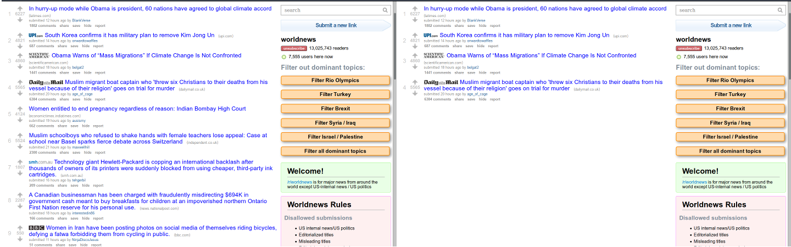
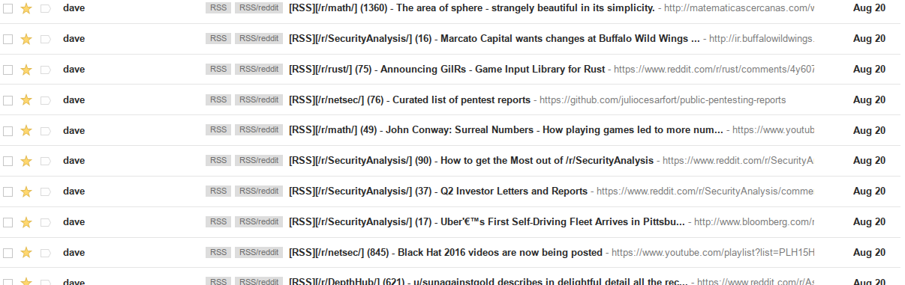

% Shortening Slow News Days
% David Wilcox

There are fast news days/weeks
---------------------------

* July 14, 2016 - Terrorist attack in Nice, France
* July 15, 2016 - a coup attempt in Turkey

News outlets everywhere are having a field day.

There are slow news days/weeks
------------------------------

The Problem
-----------

* I only want my news source to tell me important things
* My news source wants as much of my attention as it can get (for ad revenue)
* I'm either paying too much attention on slow news days, or too little attention on fast news days.

Also I waste too much time on reddit. The less time spent there the better.

The Solution
------------

Shorten slow news days

How?
----

* Take top four articles on reddit?
    + Reddit messes with order based on time
    + Is too quiet on fast news days
* Need to be context aware

We can compare points from one day to the next

How? pt2
--------

* Record standard deviation of articles per subreddit
* Set threshold, e.g. 1 standard deviation = top 33%
* On fast news days show many results
* On slow news days show fewresults

How? pt3
--------

1. <a href="http://reddit.com/r/worldnews.json">http://reddit.com/r/worldnews.json</a> is a machine friendly version of the front page
2. Write some python to fetch the JSON file for each subreddit
3. Record each article and its points
4. Re-calculate standard deviation per subreddit
5. Email articles above threshold (top 33%) to myself
6. Create email filters to organise articles into folders and avoid flooding my inbox
7. Run the script regularly (once a day/week)

Does it work?
-------------

Conclusion
----------

* Prototype wasn't too complicated
* Although there were less articles, it was still a lot
* Took about 10 minutes for 200 emails to reach my inbox >.<
* Consuming articles from my gmail inbox on my phone was nicer
* Far less time spent on reddit!
* Running script daily isn't fun (requires laptop or server, which makes it clunky or more complicated)
* I haven't made a habit of using it :(

Questions?
----------
